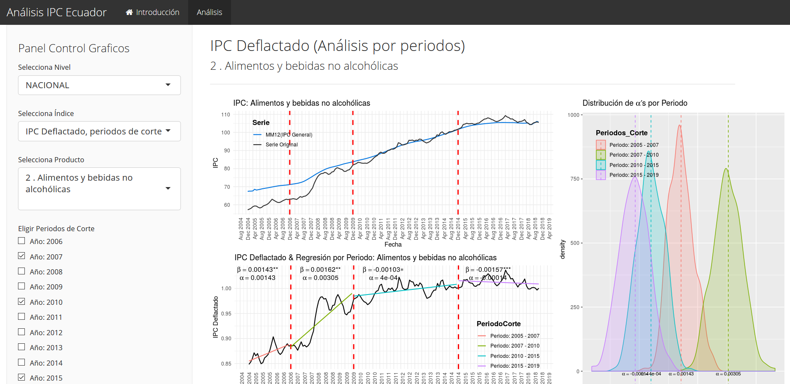

# Indice de Precios al Consumidor (Ecuador)

https://iiepuce.shinyapps.io/Analisis_IPC_Ecuador/

En el presente proyecto mostramos una aplicación de Shiny (R) que contiene un Análisis de Regresión del Indice de Precios al Consumidor desde Enero de 2005 hasta la actualidad que se actualiza a partir de datos publicados periodicamente por el INEC.

 
