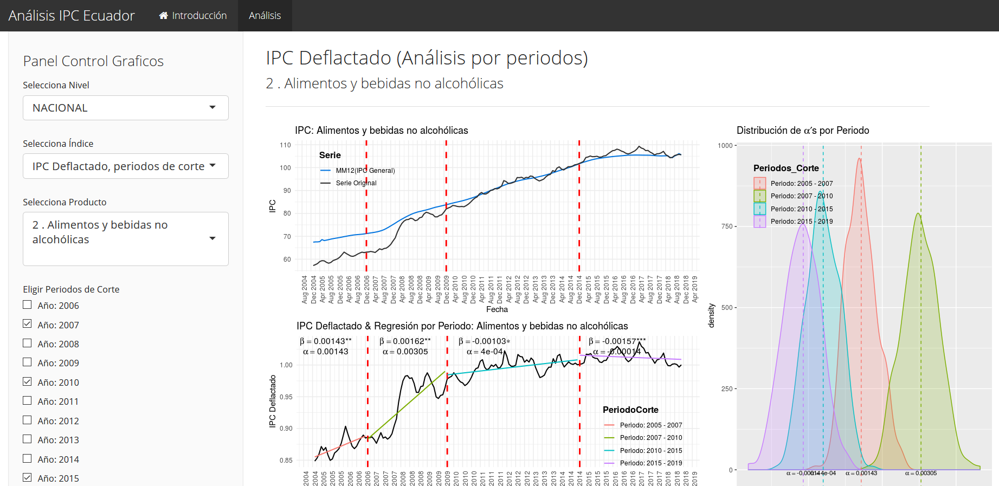

# Indice de Precios al Consumidor (Ecuador)

https://iiepuce.shinyapps.io/Analisis_IPC_Ecuador/

En el presente pryecto mostramos una aplicación de Shiny (R) que contiene un completo Análisis de Regresión del Indice de Precios al Consumidor del periodo Enero 2005 - Noviembre 2018, a partir de datos publicados periodicamente por el INEC.

 
